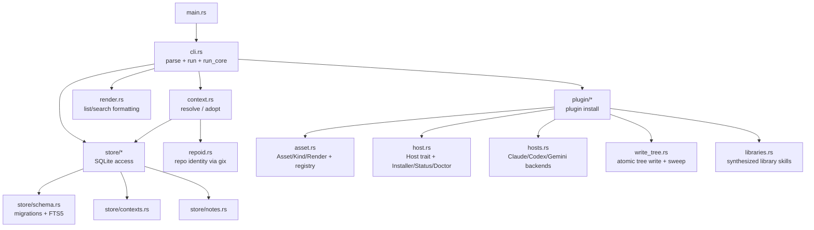
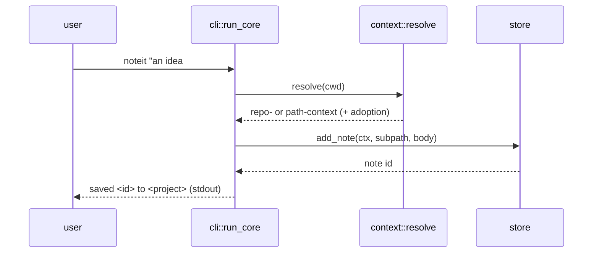
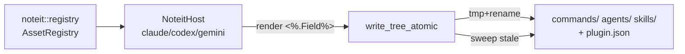

# Architecture

<!-- rev:001 -->

`noteit` is a single-binary Rust CLI (edition 2024). It captures notes that bind
to the **git repository** you run it in — notes follow a repo across clones and
renames because they key off the repo's first commit, not its path. Everything
lives in one local SQLite database.

## Module map

- **`cli.rs`** — the closed-verb parser (`VERBS`) and the `run` → `run_core`
  dispatch. `run` opens the DB and resolves the context; `run_core` is a testable
  seam that takes an already-open `Store`, a `cwd`, and an output sink. Plugin
  ops are dispatched in `run` *before* the DB opens (they're filesystem-only).
- **`context.rs` + `repoid.rs`** — resolve the current directory to a context.
  A repo resolves to a repo-context keyed by its lexicographically-smallest
  parentless root-commit SHA (`urn:noteit:v1:<sha>`, via `gix`); a non-repo path
  resolves to a path-context. `adopt_if_needed` folds path-contexts into a
  repo-context when a repo later appears.
- **`store/*`** — all SQLite access. `schema.rs` owns append-only
  `PRAGMA user_version` migrations and the FTS5 external-content table kept in
  sync by triggers; `contexts.rs`/`notes.rs` are the query layers.
- **`plugin/*`** — the plugin-host contract (ported, std-only) plus noteit's own
  assets and host backends. See [the plugin flow](#plugin-flow) below.
- **`render.rs`** — formats notes for stdout (grouped / flat / list).

## Capture flow

Notes go to **stdout**; warnings and adoption notices go to **stderr**. Every
failure path degrades to a working capture — only a DB open/migrate failure
stops the program (hard delete is the one authorized note-removing exception).

## Plugin flow

`noteit plugin install --host <h>` renders noteit's bundled assets — a skill,
three slash commands, and an agent — into a host-specific tree under
`$HOME/.<host>/plugins/noteit/` (overridable via `NOTEIT_PLUGIN_ROOT`).

Claude gets its native `.claude-plugin/plugin.json` layout with real
`commands/` + `agents/`; skills-forward hosts (Codex, Gemini) additionally
receive synthesized *library skills* so command/agent discovery survives a
skills-only surface. Writes are atomic (tmp+rename) and sweep stale assets from a
prior install. The core contract was ported from an internal Go plugin-host
package, std-only, with no new crates — see `docs/port/`.

## Storage

One SQLite DB at `%USERPROFILE%\noteit.db` (Windows) / `$HOME/noteit.db`
(Linux/macOS), WAL mode with a busy timeout so concurrent captures are safe.
Schema versions are append-only (v1, v2 shipped); FTS5 stays in sync via
triggers. `#tag` text is kept both in the note body and a separate tag table.
